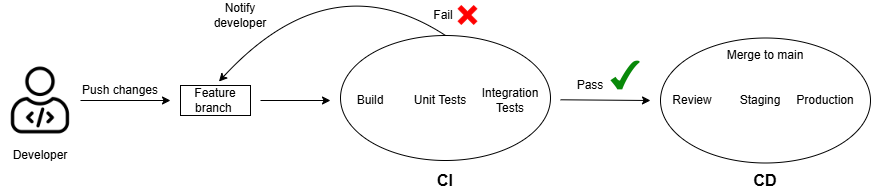
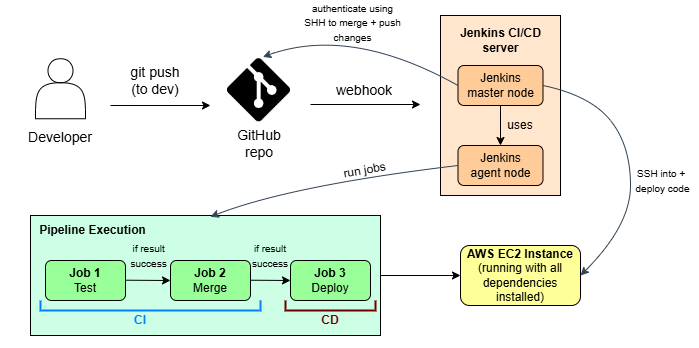
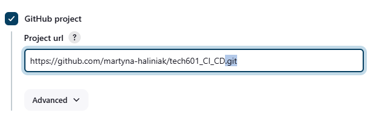
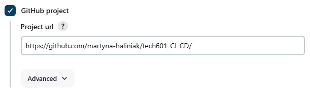
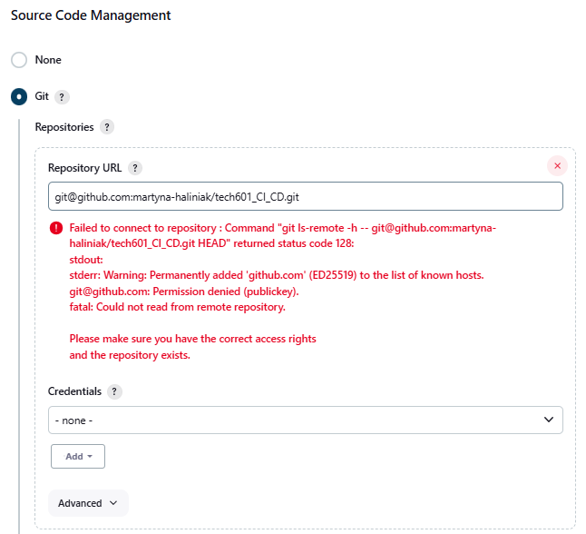
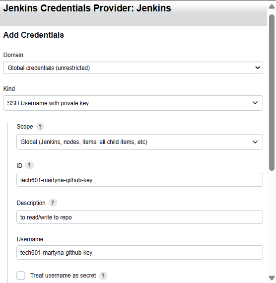
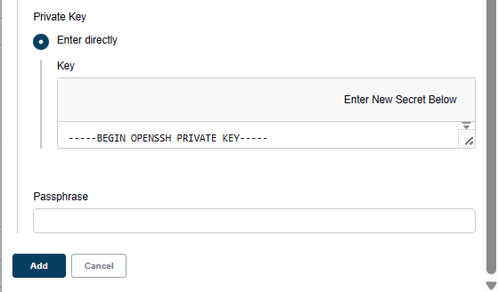
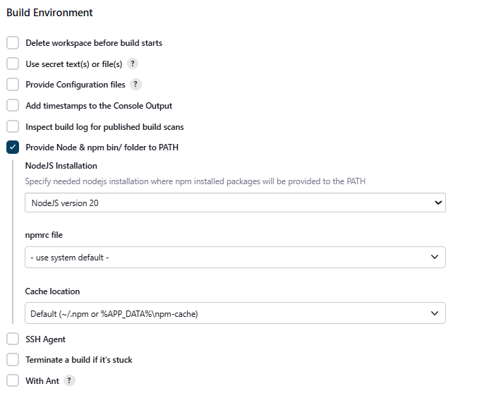
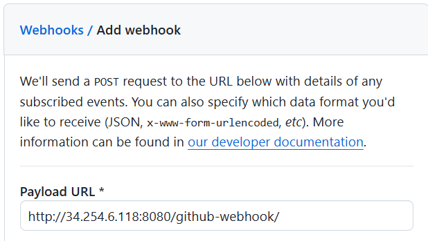
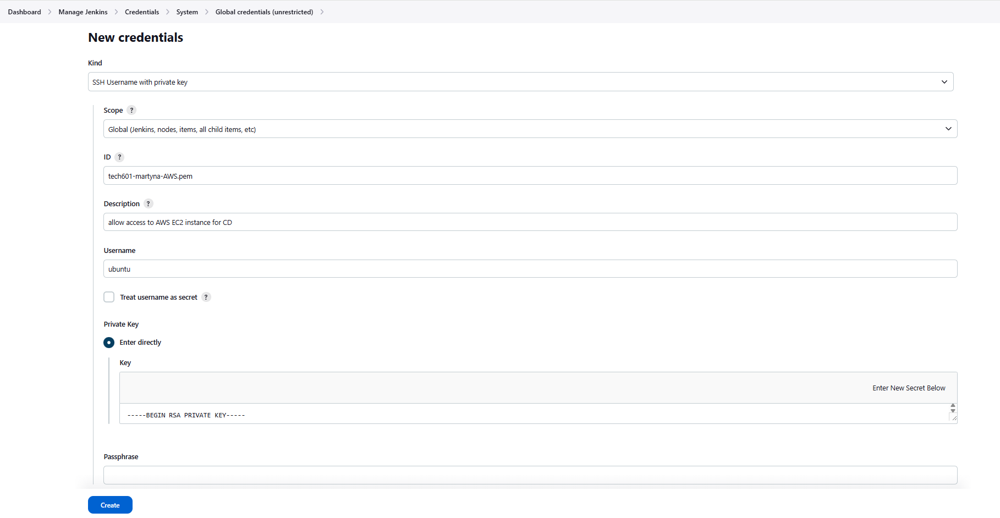

# CI/CD

- [CI/CD](#cicd)
  - [CI: Continuous Integration](#ci-continuous-integration)
    - [How it works:](#how-it-works)
    - [Benefits:](#benefits)
  - [CD: Continuous Delivery / Continuous Deployment](#cd-continuous-delivery--continuous-deployment)
    - [Continuous Delivery (CD)](#continuous-delivery-cd)
    - [Continuous Deployment (CDE)](#continuous-deployment-cde)
    - [Difference between CD (Delivery) and CDE (Deployment)](#difference-between-cd-delivery-and-cde-deployment)
  - [CI/CD Diagram](#cicd-diagram)
- [Jenkins](#jenkins)
  - [What is Jenkins](#what-is-jenkins)
  - [Why use Jenkins?](#why-use-jenkins)
    - [Benefits](#benefits-1)
    - [Disadvantages](#disadvantages)
  - [Stages in a Jenkins CI/CD Pipeline](#stages-in-a-jenkins-cicd-pipeline)
    - [What is an artifact](#what-is-an-artifact)
  - [Alternatives](#alternatives)
  - [Why Build a Pipeline? Business Value](#why-build-a-pipeline-business-value)
- [Sparta App CI/CD Pipeline (Jenkins + AWS EC2)](#sparta-app-cicd-pipeline-jenkins--aws-ec2)
  - [CI/CD Pipeline Diagram](#cicd-pipeline-diagram)
  - [Overview](#overview)
    - [Pipeline Stages](#pipeline-stages)
    - [Tools Used](#tools-used)
  - [Accessing Jenkins](#accessing-jenkins)
  - [Job 1 - CI Testing Pipeline](#job-1---ci-testing-pipeline)
    - [Setup](#setup)
    - [Webhook Setup](#webhook-setup)
    - [Triggering the Pipeline](#triggering-the-pipeline)
  - [Job 2 - CI Merge to Main](#job-2---ci-merge-to-main)
    - [Setup](#setup-1)
    - [Outcome](#outcome)
  - [Job 3 - CD Deploy to EC2](#job-3---cd-deploy-to-ec2)
    - [Architecture](#architecture)
    - [Step 1: Add EC2 SSH Credentials](#step-1-add-ec2-ssh-credentials)
    - [Step 2: Create an EC2 instance](#step-2-create-an-ec2-instance)
    - [Step 3: Create Jenkins Job](#step-3-create-jenkins-job)
    - [Outcome](#outcome-1)
  - [Testing the Pipeline](#testing-the-pipeline)
  - [Cleanup](#cleanup)


## CI: Continuous Integration
**Continuous Integration** is the practice of frequently merging small code changes into a shared repository. 

### How it works:

* Developers push code changes often 
* Automated tests run 
* Integration issues found early


### Benefits:

* Faster development
* Reduce merge conflicts
* Higher code quality
* Catch bugs early
* Confidence that the app still works after each change


## CD: Continuous Delivery / Continuous Deployment
**CD** is what happens *after* **CI**.

### Continuous Delivery (CD)

* Code changes are automatically tested and packaged
* Ready to deploy at any time
* BUT deployment still requires a manual approval


### Continuous Deployment (CDE)
* Every change that passes CI is automatically deployed to production 
* No human approval needed

### Difference between CD (Delivery) and CDE (Deployment)

| Term | Trigger | Goes to Prod? | Automation Level |
| ----------- | ----------- | ---------- | ---------- |
| CD / Continuous Delivery | Manual approve only | Optional | High |
| CDE / Continuous Deployment | Automatic | Yes | Very High |

Delivery - prepared but not released

Deployment - automatically released


## CI/CD Diagram 



# Jenkins

## What is Jenkins

Jenkins is an open-source **automation server** used for CI/CD pipelines.

**What it does:**

* Automates building, testing, deploying
* Runs pipelines defined by you 
* Integrates with GitHub
* Uses "jobs" and "pipelines"


## Why use Jenkins?

### Benefits

* **Open source & free**
* **Highly customisable**
* **Huge plugin ecosystem** (Docker, AWS, Git, Terraform, etc.)
* **Scalable** with master → agents
* **Cross-platform** (Windows, Linux, Mac)
* **Integrates with anything**


### Disadvantages

* High maintenance (plugins break, updates needed)
* Old-fashioned UI
* Can be slow
* Requires managing your own server (unlike GitHub Actions)


## Stages in a Jenkins CI/CD Pipeline

1. **SCM (Source Code Management)** \
    Pull code from GitHub, GitLab, Bitbucket etc.
2. **Build** \ 
    Create the executable/app (artifact*) \
    Example: `npm build`, `docker build`
    
3. **Test** \
    Unit tests, integration tests

4. **Package** \
    Bundle application into a deployable format

5. **Deploy/Deliver**\
    Send artifact to an environment (dev/test/prod)

6. **Monitor**\
    Health checks, logging, alerts


### What is an artifact
An **artifact** is the final output of your build.

Examples:

* `.jar`, `.war` files
* Docker image
* `.zip` deploy package
* Compiled code
* Python wheel
* Front-end build folder

Artifacts are stored in:

* Artifact repositories (Artifactory, Nexus)
* S3 buckets
* Docker registries


## Alternatives
  * GitHub Actions (most popular)
  * GitLab Cl
  * Azure Devops Pipelines
  * CircleCI
  * Travis CI
  * Bitbucket Pipelines
  * ArgoCD (Kubernetes GitOps style)
  * Tekton Pipelines


## Why Build a Pipeline? Business Value
  * Automation reduces manual work
  * Faster and more reliable releases
  * Fewer bugs reaching production
  * Shorter development cycles
  * Happier developers
  * Consistent, repeatable deployments
  * Higher product stability and customer trust
  

Pipelines improve: 
  * Speed
  * Quality
  * Reliability
  * Cost efficiency


----


# Sparta App CI/CD Pipeline (Jenkins + AWS EC2)


## CI/CD Pipeline Diagram 



---

## Overview 
Task: Implement a **3-stage CI/CD pipeline** using Jenkins to automate testing, integration, and deployment of the Sparta Test App.

### Pipeline Stages
1. **Job 1 – Continuous Integration (Testing)**
2. **Job 2 – Continuous Integration (Merge)**
3. **Job 3 – Continuous Deployment (Deploy to EC2)**

### Tools Used
- **GitHub** – Version control and webhook trigger
- **Jenkins** – CI/CD automation server
- **AWS EC2** – Application hosting environment


## Accessing Jenkins
- Hosted on an AWS EC2 instance (Jenkins Master):\
  `tech601-trainee-jenkins-server-1`
- Access via:  
  ```http
  http://<public-ip>:8080
  ```
- Login details provided

## Job 1 - CI Testing Pipeline
Automatically installs dependencies and runs tests when code is pushed to the `dev` branch.


### Setup
Start by setting up SSH for the GitHub repo (guide: [GitHub SSH](github_ssh.md))

Create a new **Freestyle Project**:\
`martyna-job1-ci-test`

* **Configuration**
  * Discard old builds: Max 5
  * Enable **GitHub Project** (use HTTPS repo link)
    * Remove the `.git` from the link:

      

    * Replace it with `/`:

      


* **Source Code Management**
  * Git repository (SSH)

    

  * Add GitHub SSH private key credentials

    

    * Paste private key

      
      
  * Branch:
    ```
    */dev
    ```

* **Build Environment**
  * Enable:
    `Provide Node & npm bin/folder to PATH`
    

* **Build Steps**\
  Run:
  ```bash
  cd app 
  npm install
  npm test
  ```

### Webhook Setup 
A **webhook** is an automated HTTP request sent from GitHub to Jenkins when changes occur (e.g. a push).

**Why we use it:**
  - Eliminates manual triggering of jobs
  - Enables real-time automation of the pipeline

We set up the webhook only for Job 1.

**Part 1 : GitHub repo now listening for the webhook**
* Go to: Repo → Settings → Webhooks → Add webhook
* Payload URL:
  ```http
  http://<jenkins-ip>:8080/github-webhook/
  ```
  
* Leave everything else as default


**Part 2 : Jenkins listening for the webhook**
* Job → Configure 
* Under Build Triggers enable:\
  `GitHub hook trigger for GITScm polling`


### Triggering the Pipeline
Create and push a `dev` branch
```bash
git branch dev
git switch dev
git push --set-upstream origin dev
```


## Job 2 - CI Merge to Main
Merges tested code from `dev` to `main`.

### Setup

Create a new job called:
`martyna-job2-ci-merge`


* **Configuration**
  * Branch:
    ```
    */dev
    ```

* **Build Trigger**
  * Build after other projects:\
    `martyna-job1-ci-test`
  * Trigger only if build is stable


* **Build Environment**
  * Enable **SSH agent**
  * Use GitHub SSH credentials

* **Build Steps**
  ```bash
  git checkout main
  git pull origin main
  git merge origin/dev
  git push origin main  
  ```


### Outcome
Job 2 runs only if Job 1 passes. The code is automatically merged into `main`.


## Job 3 - CD Deploy to EC2
Deploys the application to a live EC2 instance.

### Architecture
This setup uses three separate machines:
  * J**enkins EC2**: Master
  * **Jenkins Agent EC2**: Executes jobs
  * **App EC2**: Runs the deployed application

### Step 1: Add EC2 SSH Credentials

  * Manage jenkins → Credentials → System → Global → Add Credentials
  * Add EC2 `.pem` private key
    

This allows Jenkins to SSH into the EC2 instance using the SSH Agent plugin.


### Step 2: Create an EC2 instance
- Name: `tech601-martyna-jenkins-app`
- OS: Ubuntu 22.04 LTS
- Security Group Rules:
  - Port 22 (SSH)
  - Port 3000 (App access)

* Initial Setup (run once via SSH)
  
  SSH into the EC2 instance and install dependencies:
    ```bash
    sudo apt update -y
    sudo apt upgrade -y

    curl -fsSL https://deb.nodesource.com/setup_20.x | sudo -E bash -
    sudo apt install -y nodejs

    sudo npm install -g pm2
    ```
  Verify installation:
    ```bash
    node -v
    pm2 -v
    ```


### Step 3: Create Jenkins Job
  
* Create: `martyna-job3-cd-deploy`

* **Configuration**
  * Branch:
    ```
    */main
    ```

* **Build Trigger**
  * Trigger after:\
    `martyna-job2-ci-merge`
  * Only if stable

* **Build Environment**
  * Enable **SSH Agent**
  * Select EC2 SSH credentials


* **Build Steps** 
  * Execute Shell
      ```bash
      # copy files from Jenkins to EC2
      scp -o StrictHostKeyChecking=no -r app ubuntu@34.241.187.151:/home/ubuntu/

      # SSH into EC2 and run app
      ssh -o StrictHostKeyChecking=no ubuntu@34.241.187.151 << EOF

      cd /home/ubuntu/app

      npm install

      pm2 stop app || true
      pm2 delete app || true

      pm2 start app.js --name app
      pm2 save

      EOF
      ```

  `scp` (secure copy) is used to transfer files from the Jenkins agent to the EC2 instance over SSH

### Outcome
* Code is copied to App EC2
* App is installed and restarted
* Application is live at:
  ```http
  http://<EC2-IP>:3000/
  ```


## Testing the Pipeline

1. Edit:\
   [app/views/index.ejs](app/views/index.ejs)

2. Add:
   ```html
   <h3>CI/CD CHANGE - [timestamp]</h3>
   ```

3. Push to `dev`:
    ```bash
    git add .
    git commit -m "update homepage"
    git push
    ```

This triggers **Job 1** → **Job 2** → **Job 3** (if each passes). The change displays on web frontpage.


## Cleanup 
Before stopping server 1 jenkins instance, delete EC2 agents from jenkins UI (these will show up as unnamed running instances on aws).

