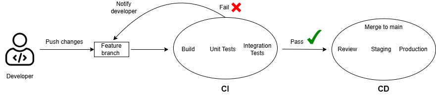

# CI/CD

- [CI/CD](#cicd)
  - [CI: Continuous Integration](#ci-continuous-integration)
    - [How it works:](#how-it-works)
    - [Benefits:](#benefits)
  - [CD: Continuous Delivery / Continuous Deployment](#cd-continuous-delivery--continuous-deployment)
    - [Continuous Delivery (CD)](#continuous-delivery-cd)
    - [Continuous Deployment (CDE)](#continuous-deployment-cde)
    - [Difference between CD (Delivery) and CDE (Deployment)](#difference-between-cd-delivery-and-cde-deployment)
  - [CI/CD Diagram](#cicd-diagram)
  - [Jenkins](#jenkins)
    - [What is Jenkins](#what-is-jenkins)
    - [Why use Jenkins?](#why-use-jenkins)
      - [Benefits](#benefits-1)
      - [Disadvantages](#disadvantages)
    - [Stages in a Jenskins CI/CD Pipeline](#stages-in-a-jenskins-cicd-pipeline)
      - [What is an artifact](#what-is-an-artifact)
    - [Alternative](#alternative)
  - [Why Build a Pipeline? Business Value](#why-build-a-pipeline-business-value)
- [move this: Ansible](#move-this-ansible)
        - [JENKINS](#jenkins-1)

## CI: Continuous Integration
**Continuous Integration** is the practice of frequently merging small code changes into a shared repository. 

### How it works:

* Developers push code changes often 
* Automated tests run 
* Integration issues found early

### Benefits:

* Faster development
* Reduce merge conflicts
* Higher code quality
* Catch bugs early
* Confidence that the app still works after each change

## CD: Continuous Delivery / Continuous Deployment
**CD** is what happens *after* **CI**.

### Continuous Delivery (CD)

* Code changes are automatically tested and packaged
* Ready to deploy at any time
* BUT deployment still requires a manual approval

### Continuous Deployment (CDE)
* Every change that passes CI is automatically deployed to production 
* No human approval needed

### Difference between CD (Delivery) and CDE (Deployment)

| Term | Trigger | Goes to Prod? | Automation Level |
| ----------- | ----------- | ---------- | ---------- |
| CD / Continuous Delivery | Manual approve only | Optional | High |
| CDE / Continuous Deployment | Automatic | Yes | Very High |

Delivery - prepared but not released

Deployment - automatically released

## CI/CD Diagram 

## Jenkins

### What is Jenkins

Jenkins is an open-source **automation server** used for CI/CD pipelines.

**What it does:**

* Automates building, testing, deploying
* Runs pipelines defined by you 
* Integrates with GitHub
* Uses "jobs" and "pipelines"

### Why use Jenkins?

#### Benefits

* **Open source & free**
* **Highly customisable**
* **Huge plugin ecosystem** (Docker, AWS, Git, Terraform, etc.)
* **Scalable** with master → agents
* **Cross-platform** (Windows, Linux, Mac)
* **Integrates with anything**

#### Disadvantages

* High maintenance (plugins break, updates needed)
* Old-fashioned UI
* Can be slow
* Requires managing your own server (unlike GitHub Actions)

### Stages in a Jenskins CI/CD Pipeline

1. **SCM (Source Code Management)** \
    Pull code from GitHub, GitLab, Bitbucket etc.
2. **Build** \ 
    Create the executable/app (artifact*) \
    Example: `npm build`, `docker build`
    
3. **Test** \
    Unit tests, integration tests

4. **Package** \
    Bundle application into a deployable format

5. **Deploy/Deliver**\
    Send artifact to an environment (dev/test/prod)

6. **Monitor**\
    Health checks, logging, alerts

#### What is an artifact
An **artifact** is the final output of your build.

Examples:

* `.jar`, `.war` files
* Docker image
* `.zip` deploy package
* Compiled code
* Python wheel
* Front-end build folder

Artifacts are stored in:

* Artifact repositories (Artifactory, Nexus)
* S3 buckets
* Docker registries

### Alternative

* GitHub Actions (most popular)
* GitLab Cl
* Azure Devops Pipelines
* CircleCI
* Travis CI
* Bitbucket Pipelines
* ArgoCD (Kubernetes GitOps style)
* Tekton Pipelines

## Why Build a Pipeline? Business Value
* Automation reduces manual work
* Faster and more reliable releases
* Fewer bugs reaching production
* Shorter development cycles
* Happier developers
* Consistent, repeatable deployments
* Higher product stability and customer trust

Business love pipelines because it improves:

* Speed
* Quality
* Reliability
* Cost efficiency

----
# move this: Ansible 

* configuration managment tool 
  

Ansible controller \
  hosts \
    - app (na)\
    - same\
    -db (na)\
    - app (eu)\
    - same\
    - db (eu)

ansible allows us to group those \
say we've got app (na) running on 10 instances\
say we wanna do a nodejs update on all of those ansible allows us to do that\
all at the same time instead of one by one 

##### JENKINS

new item , pick freestyle project

first job

ALWAYS tick discard old builds 

with max # = 3

build steps, execute shell, `uname -a` 

